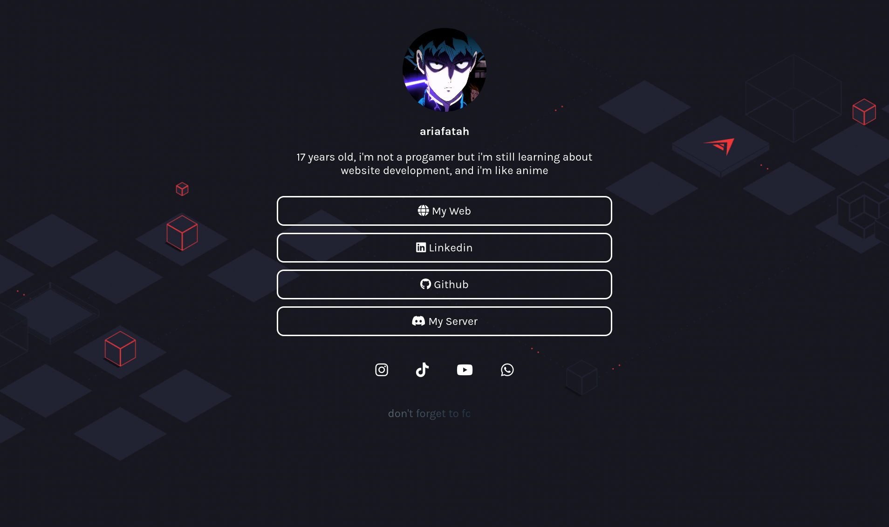

# linktree
## Linktree for my social media

<p align="center">
  <a href="#description">description</a> •
  <a href="#table-of-contents">table of contents</a> •
  <a href="#download">Download</a> •
  <a href="#related">Related</a> •
  <a href="#license">License</a>
</p>

<p id="description"></p>

## 🚀 Description
This is a web linktree that is used to make it easier to find a social media link

<p id="table-of-contents"></p>

## 📋 Table of Contents
<details open>
  <summary><b>preview</b></summary>

  
</details>

<p id="download"></p>

## 🔨 Download

1. Open a terminal or command prompt on your computer.
2. Navigate to the directory where you want to save this project.
3. Use the following command to download the project from the GitHub repository:
```sh
git clone https://github.com/ariafatah0711/linktree.git
```

<p id="related"></p>

## 📈 related
<a href="https://ariafatah0711.github.io/linktree" alt="DEMO"></a>

<p id="license"></p>

## ©️ license
<a href="https://github.com/ariafatah0711" alt="CREATED"></a>
<a href="https://github.com/ariafatah0711/linktree/blob/main/LICENSE" alt="LICENSE"></a>
